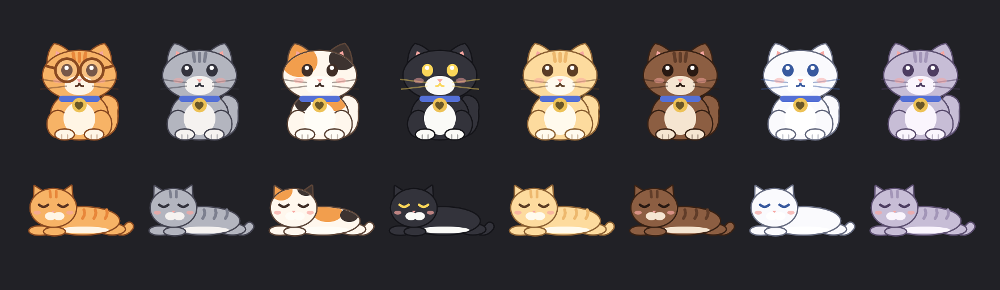

# Cataholic

A chunky cat (or a hundred) that lives on your Mac.



- **Eight coats** — Ginger (in reading glasses), Smokey, Patches, Tux, Butter, Cocoa, Snow, Lilac.
- **Gravity** — drag your cat off the menu bar and let go: it falls and lands on the Dock or the top of a
  window. Throw it and it flies. Move the window it's sitting on and it falls off.
- **Zoomies** — a leg-scramble start, a galloping run, hops, and skids that lean back.
- **The multiplier** — right-click → *More cats* → up to 100 cats raining onto your screen. They never block a
  click; only your own cat is pettable.
- **Pet it** — click for a purr and a happy squint.
- **Quick launch** — save links and apps (right-click → *Quick launch*); double-click the cat opens your favourite
  (no favourite yet → zoomies).
- **Signs** — any app or script can make your cat hold up a number, and it whispers when the number goes up:

  ```bash
  open "cataholic://sign?count=3&note=Build%20failed"   # hold up 3
  open "cataholic://sign?count=0"                         # put it down
  open "cataholic://zoomies"
  ```
- Naps melted flat when you're away. Quiet mode and Reduce Motion calm everything down.

Cat sounds are CC0 / public-domain recordings — see `Resources/Sounds/CREDITS.md`.

## Install

1. Download `Cataholic-0.2.1.zip` from [Releases](../../releases), unzip it, and drag **Cataholic** into Applications.
2. **This first release isn't signed by Apple yet** (the developer account is still being approved), so macOS
   will refuse the first launch. Open **System Settings → Privacy & Security**, scroll down, and click
   **Open Anyway** next to Cataholic. You only do this once. Signed builds are coming, and they'll open normally.
3. A paw appears in your menu bar and a cat in the top-right corner. Right-click the cat for everything.

Needs macOS 13 (Ventura) or later. Runs natively on Apple silicon and Intel.

## Build

```bash
./scripts/build.sh      # → dist/Cataholic.app (universal: Apple silicon + Intel), macOS 13+
```

No Xcode project — plain `swiftc`.
